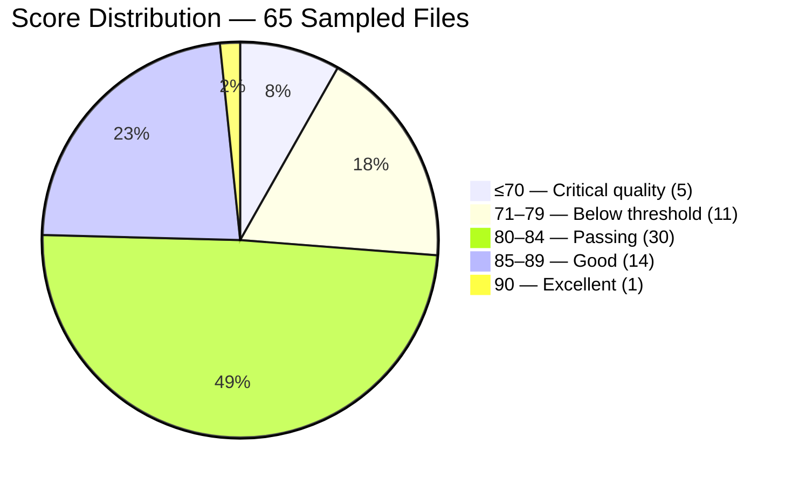
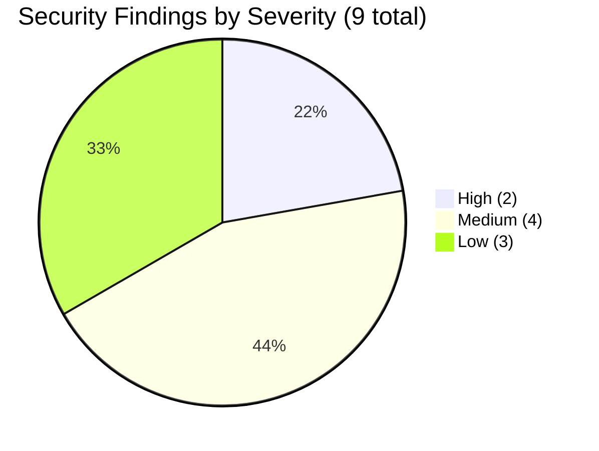
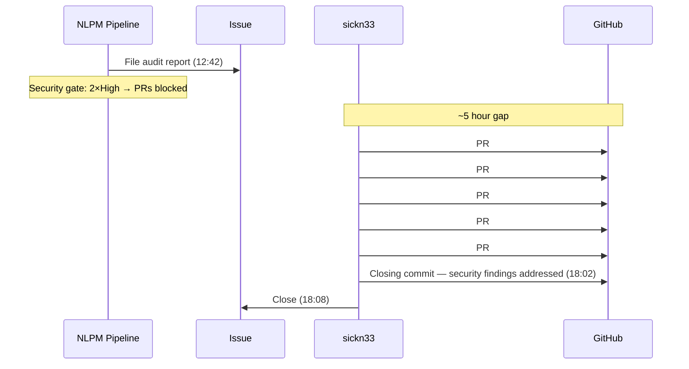
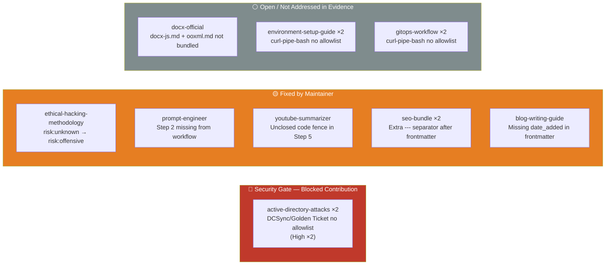
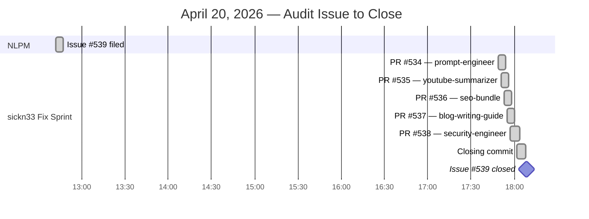

# Security Gate, No PRs, Five Fixes in Thirteen Minutes: What 34,000 Stars Look Like Up Close

> **Disclosure**: This article was generated by an automated pipeline using Claude (Sonnet 4.6) based on audit data and GitHub records. It describes work performed by NLPM tooling maintained by [xiaolai](https://github.com/xiaolai). Readers should weigh claims accordingly. The NLPM pipeline did not request comment from the maintainer before publication.

---

## The Project

[sickn33/antigravity-awesome-skills](https://github.com/sickn33/antigravity-awesome-skills) is an installable GitHub library of 1,400+ agentic skills for Claude Code, Cursor, Codex CLI, Gemini CLI, and Antigravity, bundled with an installer CLI, workflows, and both official and community skill collections. Maintained by [sickn33](https://github.com/sickn33), it has accumulated **34,271 stars** and 5,663 forks — making it the largest agentic skill library NLPM has audited. At that scale, it has crossed from plugin into infrastructure.

The repo is organized into eleven named bundles (devops-cloud, security-engineer, seo-specialist, typescript-javascript, essentials, and others) plus two very large flat collections: `antigravity-awesome-skills` (1,381 SKILL.md files) and `antigravity-awesome-skills-claude` (1,396 SKILL.md files). At time of audit, the total artifact count was **2,998 SKILL.md files** across 39 plugin bundles — roughly 30× larger than a typical plugin repo, the difference between a school library and a city one.

---

## The Audit

NLPM ran a stratified-sampling audit on 2026-04-17, covering 65 files across all major bundle categories. Full enumeration of all 2,998 files was infeasible; the score carries a ±3 confidence margin. The repository was included via NLPM's automated discovery criteria (star count, artifact volume) — not explicit maintainer registration or opt-in.

**Overall NL Score: 82 / 100**

*Individual file scores ranged from 60 (gdpr-data-handling — a body consisting entirely of "open implementation-playbook.md") to 90 (protect-mcp-governance — 3 worked examples, Cedar policy code, full output format). The single 90-scoring file was a genuine standout in a collection where most files cluster between 80 and 84. The distance between those two extremes is not just 30 points — it is the difference between a pointer and a map.*

The bundle breakdown showed meaningful variation:

| Bundle | Files Sampled | Avg Score | Notable |
|--------|--------------|-----------|---------|
| antigravity-bundle-devops-cloud | 7 | 87 | Strongest bundle; aws-serverless, kubernetes, terraform all 87+ |
| antigravity-bundle-essentials | 5 | 83 | systematic-debugging and kaizen are standouts |
| antigravity-bundle-typescript-javascript | 5 | 80 | nextjs-app-router stub drags average |
| antigravity-bundle-security-engineer | 7 | 80 | Risk labeling inconsistencies across bundle |
| antigravity-bundle-seo-specialist | 7 | 79 | Extra `---` separators in 2 files; thin content throughout |
| antigravity-awesome-skills | 20 | 81 | Stub skills drag avg; protect-mcp-governance is excellent |
| antigravity-awesome-skills-claude | 4 | 83 | active-directory-attacks well-structured; agent-orchestrator bilingual |

The audit found **8 bugs** and **9 security findings**. The security findings broke down as:

No Critical findings were identified. The two High findings were the same structural gap repeated across the two mirrored collections: `active-directory-attacks/SKILL.md` contained DCSync attack examples (lsadump::dcsync, secretsdump.py) and Golden Ticket forgery commands (kerberos::golden) without a `<!-- security-allowlist -->` annotation. The file correctly carried `risk: offensive` and an "AUTHORIZED USE ONLY" disclaimer, but the pattern scanner flags unannotated credential-extraction content regardless of the disclaimer — and the High severity classification is correct under NLPM's policy. NLPM requires a machine-readable `<!-- security-allowlist -->` annotation in addition to a human-readable disclaimer; whether that standard is stricter than necessary is a judgment call the maintainer may reasonably contest. This is a policy gap, not malicious content.

The four Medium findings were annotation gaps on legitimate installer commands and one risk-label mismatch. The three Low findings were a narrow-scope autonomous runner, false-positive detection patterns in a defensive security tool, and an undocumented external script dependency.

Key security positives were notable: 50+ `risk: offensive` skills across both large collections consistently carry "AUTHORIZED USE ONLY" disclaimers; cloud-penetration-testing and linux-privilege-escalation are correctly annotated with `<!-- security-allowlist: curl-pipe-bash -->`; no hardcoded real credentials were found anywhere in 2,998 files.

---

## What Was Submitted

NLPM submitted **one tracking issue** and **zero pull requests**.

[Issue #539](https://github.com/sickn33/antigravity-awesome-skills/issues/539) — "NLPM Audit Report: 8 bugs and 9 security findings (NL Score: 82/100)" — was filed at 2026-04-20 12:42 UTC and contained the full audit report.

No PRs were submitted because the security gate blocked contribution — which is precisely what the gate is for. NLPM's contribute workflow requires all High-severity security findings to be cleared before a PR can be opened against a repository. The two `active-directory-attacks` annotation gaps — one in each mirrored collection — each registered as a separate High finding. Both must be manually cleared before automated contribution is approved.

This is the gate working as designed: findings that require human judgment about security labeling policy should not be resolved by an automated PR.

---

## The Response

sickn33 resolved the issue **5 hours and 26 minutes** after it was filed.

Between 17:49 and 18:02 UTC on April 20 — thirteen minutes, about the time it takes to read the audit report once — five fix PRs were merged and a closing commit landed:

All five fix PRs carry `Co-authored-by: claude[bot]` — sickn33 used Claude Code to implement the fixes. The commit messages are precise: each names the exact file, the exact symptom, and the fix applied. The security-engineer fix (PR #538) is the most substantive — it corrects `risk: unknown` to `risk: offensive` in `ethical-hacking-methodology/SKILL.md` and adds the "AUTHORIZED USE ONLY" disclaimer used consistently across the rest of the bundle.

The closing commit (8deb5dc) is titled "fix(security): close NLPM findings and add OpenCode loop recovery guidance" — with a title that may indicate sickn33 addressed additional security findings beyond what the individual fix PRs covered and added guidance around a separate issue (OpenCode loop recovery). The specific files changed are not in the evidence record; this is unverified (see Limitations).

sickn33 was not asked for comment before this article was published — see disclosure above. The fix activity is the available record of the maintainer's perspective on the findings.

---

## What the Audit Revealed

The 8 bugs grouped into three patterns:

**The stub pattern** was the most significant systemic finding. At least four skills — `gdpr-data-handling`, `tailwind-design-system`, `nextjs-app-router-patterns`, and `tavily-web` — delegate their entire content to `resources/implementation-playbook.md`. Claude Code does not automatically load that file when a user invokes the skill — in NLPM's loading model. The result is a skill that responds with empty or generic guidance while the actual content sits one level up, invisible to the runtime — like a sign pointing to a room that isn't on the map. Whether this is a bug or an intentional design depends on whether Claude Code resolves sibling files within an installed skill bundle; NLPM's scanner applies its own loading assumptions and may not match the runtime's actual behavior.

**The duplication pattern** means any bug found in `antigravity-awesome-skills` almost certainly also exists in `antigravity-awesome-skills-claude`. Both collections are near-mirrors of each other (1,381 vs 1,396 files). The audit identified this early and verified findings in both copies before reporting. Security fixes in particular needed to be applied to both. A defect in a mirror is always twice the work.

**The risk-label pattern** in the security-engineer bundle was inconsistent: `burp-suite`, `cloud-penetration-testing`, and `linux-privilege-escalation` all use `risk: offensive` correctly. `ethical-hacking-methodology`, `security-auditor`, and `top-web-vulnerabilities` used `risk: unknown` — which may signal unevaluated risk rather than a deliberate categorization matching the offensive-tool pattern, but is inconsistent with the bundle's other labels. The fix to `ethical-hacking-methodology` was merged; the remaining two are quality findings, not security blockers (status as of 2026-04-20 issue close; no follow-up was made and they are left to the maintainer's discretion).

The broader quality issues (42 total) were dominated by two penalties: missing output format sections and vague language. No output format was found in over a third of sampled skills, including high-quality ones like `terraform-specialist`, `kubernetes-architect`, and `docker-expert`. Vague terms ("appropriate", "relevant", "best practices", "modern", "robust") appeared 3–8 times per file in many skills — the comfort food of technical writing: filling, familiar, and low in nutrition.

---

## Timeline

*Note: The NLPM audit itself ran on 2026-04-17 — three days before the issue was filed. The three-day gap reflects pipeline scheduling, not analysis time. The chart focuses on the response day.*

---

## Limitations

**Sampling, not census.** The 82/100 score reflects 65 of 2,998 files — 2.2% of the collection. The stratified sample covered all major bundles, but thousands of files were not examined. The score should be read as an estimate with ±3 margin, not a precise measurement.

**No PR merge data.** NLPM did not submit any PRs to this repository. The five fix PRs (#534–538) were opened and merged by sickn33. This article cannot speak to what a NLPM-submitted PR would have looked like or whether it would have been accepted. The response data covers the maintainer's own activity, not an NLPM contribution outcome.

**Commit intent is inferred.** The closing commit's title mentions "close NLPM findings" — this is taken as evidence that additional security findings were addressed, but the specific files changed are not in the evidence record. The article reports this as probable but not confirmed.

**Duplication coverage.** The two mirrored collections were sampled proportionally but not exhaustively cross-checked. Additional bugs unique to one collection may exist that were not detected.

---

*sickn33 maintains this project as a solo effort — 2,998 skill files across 39 bundles, actively updated. An 82/100 score 12 points above the default 70 threshold, in a collection of this scale, reflects genuine quality orientation. The 42 open quality findings should be read in that context — and with the generosity that scale deserves.*

## Significance

This engagement produced a different outcome from the typical NLPM contribution pattern — not because the findings were weak, but because the security gate worked correctly. Two High-severity findings in both copies of `active-directory-attacks` required human judgment about security annotation policy; an automated PR was not the right vehicle.

What happened instead: the audit issue was filed, and the maintainer fixed five bugs and at least one security finding within 5.5 hours using Claude Code. The maintainer's self-directed response was complete before a typical PR review cycle would have concluded. In open source, it is perfectly fine to arrive second with the right list.

From the pipeline's standpoint, this is a reasonable argument for the audit-issue path as a first-class outcome alongside the PR path: for repositories at this scale, an audit report the maintainer can act on directly may be more efficient than a PR requiring review overhead. That framing reflects NLPM's interest in validating the audit-issue path; readers should weigh it accordingly. The security gate blocked automated contribution — whether that is better described as the system routing work correctly or as a limitation on NLPM's contribution capability depends on your perspective.

The 42 quality issues (stub skills, missing output formats, vague language) remain open. They represent a genuine improvement surface for a library used at 34,000-star scale, but they are not blockers — the repository scores above threshold and the mechanical bugs have been addressed. Sometimes the most useful thing a pipeline can do is hand someone a clear list and get out of the way.
