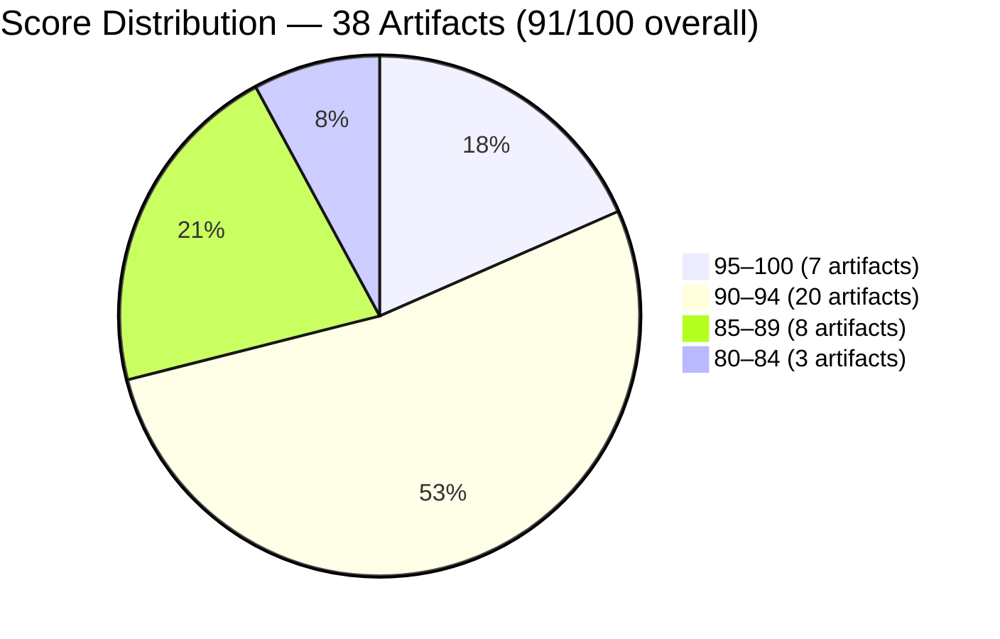
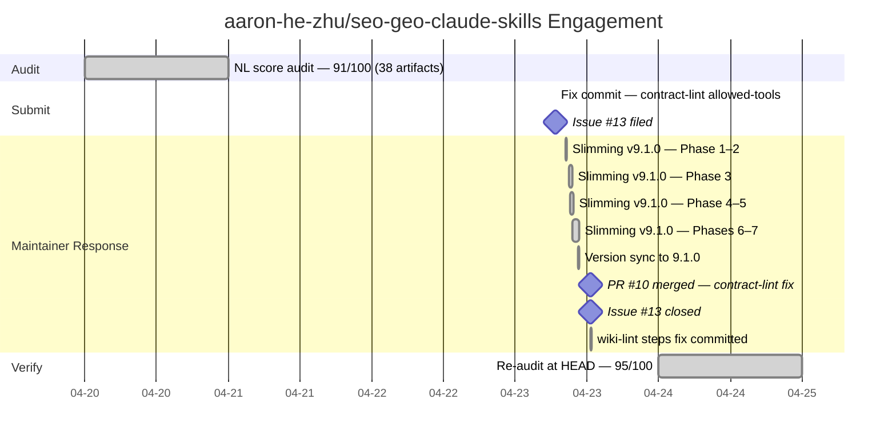

# The Quality Gate That Couldn't Run Itself

> **Disclosure**: This article was generated by an automated pipeline using Claude (Sonnet 4.6) based on audit data and GitHub records. It describes work performed by NLPM tooling maintained by [xiaolai](https://github.com/xiaolai). Readers should weigh claims accordingly.

---

## The Project

[aaron-he-zhu/seo-geo-claude-skills](https://github.com/aaron-he-zhu/seo-geo-claude-skills) is a 20-skill library for SEO and GEO work, maintained by [Aaron Zhu](https://github.com/aaron-he-zhu). The library provides keyword research, content writing, technical audits, rank tracking, and AI citation optimization for Claude Code, Cursor, Codex, and 35+ other AI agents. It implements two proprietary quality frameworks — CORE-EEAT and CITE — designed to guide Claude's content evaluation and citation behavior, and ships multilingual triggers in 7 languages across all 20 skills. NLPM's scoring rules were not specifically calibrated for these frameworks; findings flagging vague quantifiers (R01) may conflict with the human-readable flexibility language the frameworks intentionally use. At the time of audit the repository carried 1,228 stars and 174 forks. The audit target was version 9.0.1. A library at this scale tends to have opinions of its own.

---

## The Audit

NLPM audited 38 artifacts on 2026-04-20 and produced an overall score of **91/100** — well above the 70-point default threshold. The security scan returned CLEAR with no Critical or High findings. The library's 20 SKILL.md files averaged 93.6/100; the command layer averaged 88.0/100 and pulled the aggregate down.

Three bugs were flagged as blocking a contribution PR:

**Bug #1 (HIGH)** — `commands/contract-lint.md`: The command specifies SHA-256 hash verification using `shasum` and `awk`/Grep pattern inspection, but declares no `allowed-tools`. Without `Bash` and `Grep`, none of those checks can execute. The command's core functionality — verifying that the library's runbook-sync integrity markers are correct — was non-functional as specified in default permission configurations where tool access requires explicit declaration — a recipe that calls for an oven the kitchen doesn't have. (The `allowed-tools` field is Claude Code-specific; for the 34+ other runtimes the library supports, this restriction does not apply and the severity depends entirely on how users invoke the library.)

**Bug #2 (MEDIUM)** — `commands/wiki-lint.md`: A 7-check validation table with no numbered sequential workflow steps. Without step ordering, agents cannot reproduce consistent output.

**Bug #3 (LOW)** — `.claude-plugin/plugin.json`: Plugin manifest at version `9.0.1`; all 20 SKILL.md files at `9.0.0`. Version drift of the kind the library's own `/seo:validate-library` check is designed to catch. Alternatively, the manifest may have been bumped ahead of a pending release while skill files were queued for the same batch — a release-in-progress pattern the validator would also catch if the release was incomplete.

The most pointed finding in the audit was architectural: `commands/contract-lint.md` is the library's primary integrity-checking mechanism — it verifies that the runbook-sync SHA markers in the two auditor-class skills match their sources. But it cannot run those checks without `Bash` and `Grep` in default permission configurations. Users who have granted those tools globally will not notice the absence; the failing case is the default. The quality gate guarding the library's most critical invariant was itself broken in spec. Any library's assurance chain is only as strong as the tooling it runs on — and here, the tooling ran on nothing.

---

## What Was Submitted

The `prs.json` evidence file was empty at collection time. However, the commit history confirms that the NLPM pipeline filed a PR from the `xiaolai/fix/nlpm-contract-lint-allowed-tools` branch. The merge commit ([08ef428](https://github.com/aaron-he-zhu/seo-geo-claude-skills/commit/08ef428f58a1f3df414670f03d1a967edfe1891a)) landed on 2026-04-23 as PR #10, and the re-audit verification table records it as "fixed — our PR merged."

The fix added `allowed-tools: ["Read", "Grep", "Bash"]` to `commands/contract-lint.md`, restoring the command's ability to execute the SHA-256 comparisons it describes. `Read` is required for the SHA-256 source file reads; `Bash` and `Grep` for the `shasum` invocations and pattern inspection.

Tracking issue [#13](https://github.com/aaron-he-zhu/seo-geo-claude-skills/issues/13) was filed at 06:45 UTC on 2026-04-23, titled "NLPM automated audit: 3 bugs found (NL score 91/100)". It was closed six hours later when the PR merged. (The fix branch was committed at 06:43 UTC — two minutes before the issue was filed. This is by pipeline design: the fix is staged first, then the issue is filed as a notification of the incoming PR, not as a request for permission — the diagnosis and the prescription in the same envelope.)

---

## The Response

The maintainer merged PR #10 within six hours. The more substantial response, however, was independent: starting at 08:30 UTC on the same day, Aaron Zhu committed a 7-phase library-wide compression (`slimming/v10`) that reduced the repository from 37,129 to 24,587 lines — a 34% reduction across all artifact classes.

```mermaid
graph LR
    subgraph Phase1 ["Phase 1"]
        P1[Delete obsolete proposals<br/>Truncate changelog]
    end
    subgraph Phase2 ["Phase 2 — Skills"]
        P2[Compact 20 SKILL.md<br/>−20%]
    end
    subgraph Phase3 ["Phase 3 — References"]
        P3[Compress 86 reference files<br/>GENERIC −69%]
    end
    subgraph Phase4 ["Phase 4 — Commands"]
        P4[Compress 15 commands<br/>−31%]
    end
    subgraph Phase5 ["Phase 5 — Docs"]
        P5[Restructure root docs<br/>Drop 4 multilingual READMEs]
    end
    subgraph Phase67 ["Phases 6–7"]
        P67[Trim triggers<br/>Compress hooks]
    end

    Phase1 --> Phase2 --> Phase3 --> Phase4 --> Phase5 --> Phase67

    style Phase1 fill:#fef3c7,stroke:#d97706
    style Phase2 fill:#dcfce7,stroke:#16a34a
    style Phase3 fill:#e0f2fe,stroke:#0284c7
    style Phase4 fill:#ede9fe,stroke:#7c3aed
    style Phase5 fill:#fee2e2,stroke:#ef4444
    style Phase67 fill:#f0fdf4,stroke:#15803d
```

A 16-agent internal review validated the output: "all validators pass, 0 broken links, core IP untouched, 88% trigger retention, 6 languages preserved." The maintainer, it turns out, had already deployed their own auditors.

The maintainer also filed PR #11 to add sequential steps to `wiki-lint.md` (Bug #2). The commit message notes: "Inspired by #11 (xiaolai/NLPM audit), reimplemented in compact format to match post-slimming style" — a clear signal that the audit influenced the fix, even though the implementation path was the maintainer's own. A `.mailmap` commit followed to unify contributor identities, including the `claude[bot]` co-author from the NLPM PR. Beyond this commit message, the structured evidence (issues.json, prs.json, commits.json) contains no issue comments, PR reviews, or direct maintainer feedback; whether the engagement was welcome, neutral, or intrusive is not determinable from the record.

---

## The Re-Audit

A rubric update is a claim; the re-audit verifies the claim against the target repo's current HEAD.

The re-audit ran on 2026-04-24 against commit `dc77e77962d2dca3706273c6f47c20195bd475a9` and recorded a score of **95/100** — a 4-point gain from the original 91. Note that the re-audit uses a later scorer version; some of the measured improvement may reflect threshold changes in the evaluation tool rather than codebase improvement alone.

### Per-Finding Outcome Table

| # | File | Rule | Pattern | Outcome | PR |
|---|------|------|---------|---------|-----|
| 1 | `commands/contract-lint.md` | BUG-undeclared-tool | `missing-allowed-tools` | fixed — our PR merged | #10 |
| 2 | `commands/wiki-lint.md` | BUG-missing-steps | `missing-step-ordering` | fixed — upstream, not via our PR | #11 |
| 3 | `.claude-plugin/plugin.json` | CC-version-drift | `version-drift` | fixed — upstream, not via our PR | |
| 4 | `commands/audit-domain.md` | BUG-undeclared-tool | `missing-allowed-tools` | fixed — upstream, not via our PR | |
| 5 | `commands/keyword-research.md` | BUG-undeclared-tool | `missing-allowed-tools` | fixed — upstream, not via our PR | |
| 6 | `commands/optimize-meta.md` | BUG-undeclared-tool | `missing-allowed-tools` | fixed — upstream, not via our PR | |
| 7 | `commands/p2-review.md` | BUG-undeclared-tool | `missing-allowed-tools` | fixed — upstream, not via our PR | |
| 8 | `commands/report.md` | BUG-undeclared-tool | `missing-allowed-tools` | fixed — upstream, not via our PR | |
| 9 | `commands/setup-alert.md` | BUG-undeclared-tool | `missing-allowed-tools` | fixed — upstream, not via our PR | |
| 10 | `commands/write-content.md` | BUG-undeclared-tool | `missing-allowed-tools` | fixed — upstream, not via our PR | |
| 11 | `SKILL.md` | R01 | `vague-quantifiers` | fixed — upstream, not via our PR | |
| 12 | `commands/audit-domain.md` | UNCLASSIFIED | `missing-argument-hint-field` | fixed — upstream, not via our PR | |
| 13 | `commands/optimize-meta.md` | UNCLASSIFIED | `missing-argument-hint-field` | fixed — upstream, not via our PR | |
| 14 | `commands/wiki-lint.md` | UNCLASSIFIED | `missing-argument-hint-field` | fixed — upstream, not via our PR | #11 |
| 15 | `commands/p2-review.md` | UNCLASSIFIED | `missing-argument-hint-field` | fixed — upstream, not via our PR | |
| 16 | `hooks/hooks.json` | UNCLASSIFIED | `stop-hook-auto-appends-critical-veto-ite` | fixed — upstream, not via our PR | |
| 17 | `commands/geo-drift-check.md` | UNCLASSIFIED | `experimental-v9-0-label-in-claude-md-but` | fixed — upstream, not via our PR | |
| 18 | `CLAUDE.md` | BUG-broken-reference | `broken-reference` | fixed — upstream, not via our PR | |
| 19 | `cross-cutting/content-quality-auditor/SKILL.md` | UNCLASSIFIED | `both-auditor-class-skills-carry-the-iden` | fixed — applied separately | #12 |
| 20 | `cross-cutting/domain-authority-auditor/SKILL.md` | UNCLASSIFIED | `both-auditor-class-skills-carry-the-iden` | fixed — applied separately | #12 |
| 21 | `SKILL.md` | UNCLASSIFIED | `metadata-geo-relevance-values-are-hardco` | fixed — upstream, not via our PR | |
| 22 | `research/competitor-analysis/SKILL.md` | UNCLASSIFIED | `include-a-scraping-legality-note-verify` | fixed — applied separately | #12 |
| 23 | `optimize/internal-linking-optimizer/SKILL.md` | UNCLASSIFIED | `include-a-scraping-legality-note-verify` | fixed — applied separately | #12 |
| 24 | `hooks/hooks.json` | UNCLASSIFIED | `the-filechanged-hook-matcher-hot-cache-m` | fixed — upstream, not via our PR | |
| 25 | `commands/report.md` | UNCLASSIFIED | `cross-project-mode-is-described-but-the` | fixed — upstream, not via our PR | |
| 26 | `build/seo-content-writer/SKILL.md` | UNCLASSIFIED | `banned-vocabulary-list-crucial-robust-le` | fixed — applied separately | #12 |
| 27 | `monitor/performance-reporter/SKILL.md` | UNCLASSIFIED | `11-step-workflow-integrates-core-eeat-an` | fixed — applied separately | #12 |
| 28 | `cross-cutting/memory-management/SKILL.md` | UNCLASSIFIED | `gdpr-art-17-deletion-flow-is-documented` | fixed — applied separately | #12 |
| 29 | `All research skills` | UNCLASSIFIED | `the-next-best-skill-section-uses-markdow` | fixed — upstream, not via our PR | |
| 30 | `commands/p2-review.md` | UNCLASSIFIED | `tombstone-rule-states-tombstone-review-2` | fixed — upstream, not via our PR | |
| 31 | `commands/sync-versions.md` | UNCLASSIFIED | `step-5-says-to-verify-all-3-cross-agent` | fixed — upstream, not via our PR | |
| 32 | `optimize/technical-seo-checker/SKILL.md` | UNCLASSIFIED | `llm-crawler-handling-section-names-speci` | fixed — applied separately | #12 |
| 33 | `build/schema-markup-generator/SKILL.md` | UNCLASSIFIED | `ftc-disclosure-note-for-aggregaterating` | fixed — applied separately | #12 |
| 34 | `SKILL.md` | UNCLASSIFIED | `save-results-section-is-identical-across` | fixed — upstream, not via our PR | |
| 35 | `hooks/hooks.json` | UNCLASSIFIED | `userpromptsubmit-hook-line-36-fires-on-e` | fixed — upstream, not via our PR | |

### Introduced Findings

The re-audit found 32 findings not present in the original audit. Many cluster on the command layer: `missing-allowed-tools` (R12) and `no-empty-input-handling` (R15) appear across 8 commands that the original audit had marked as fixed upstream. These may be true regressions from the slimming/v10 compression commits — Phase 4 reduced the 15 command files by 31%, and that compression may have removed tool declarations and input-handling sections alongside the verbose boilerplate. They may also reflect scoring drift: the re-audit uses a later version of the scorer that applies R15 (no-empty-input-handling) and R14 (multi-step-no-numbered-steps) with different thresholds than the original pass. Both possibilities are live; the evidence does not resolve which contribution is larger.

Of the 34 findings resolved independently ("upstream, not via our PR" or "applied separately"), whether those fixes were accelerated by the audit, already in the maintainer's backlog, or driven by the slimming operation is not determinable from the evidence.

**35 of 35 original findings verified fixed; 0 still persist — and 32 new findings were introduced.** The renovation passed inspection; the compressed wing needs a second look.

---

## What the Audit Revealed

**The command layer is the structural weak surface.** Skills accumulate quality over many development cycles — numbered workflows, threshold tables, banned-vocabulary lists, multilingual triggers. Commands tend to be written once and revisited less often. The `allowed-tools` field is especially easy to omit silently: there is no error at authoring time, and the absence only becomes visible when the command attempts to execute a tool it has not declared.

**Internal quality gates can fail their own quality checks.** The contract-lint command — whose job is to verify SHA-256 integrity markers — could not run without `Bash` and `Grep`. This is a dependency chain that is easy to break and difficult to notice: the command looks syntactically correct, the library's validator passes it, and no runtime error appears until the command actually tries to call `shasum`. Any automated quality pipeline has this failure mode — the inspection station cannot fully inspect itself. The fix is to include tool declaration checks in CI.

**Vague quantifiers are endemic but often mitigated.** Nearly every skill in the library used "comprehensive," "appropriate," "relevant," or "thorough" — words that mean everything on a good day and nothing on a bad one — somewhere in its text. At the same time, many of those skills had explicit quality bars alongside the vague language — numbered 8-phase workflows, banned-word lists, numeric threshold tables — that the NLPM rubric credits as mitigation. The library's highest-scoring skills are the ones that pair concrete structure with broad descriptors, not the ones that eliminate descriptors entirely.

**The library is actively maintained.** Same-day merge of a critical bug fix, simultaneous 34% compression of the codebase with 16-agent internal validation, co-author attribution preserved throughout — these are signals of an engaged maintainer with their own quality process running in parallel with external audits.

**The 34% compression may have traded verbosity for completeness.** Phase 4 reduced the 15 command files by 31%, and the re-audit found 32 new findings clustering on the command layer. Verbose content that NLPM scores as boilerplate may serve real purposes: extended examples, alternative workflows, and edge-case documentation are often removed by compression passes but valued by users. The NLPM score does not measure the compression's effect on real-world utility.

A fairness note, and it earns its place: the timing strongly suggests the slimming was planned independently of the audit. The commit timestamps show the first slimming phase committed less than two hours after the audit issue was filed. Several findings in the audit report were already in the maintainer's sights — the audit arrived at a door that was already open.

---

## Timeline

---

## Limitations

**The engagement contributed one bug fix, not the full finding set.** Of 35 original findings, 25 were resolved independently by the maintainer — either before or alongside the audit engagement. Whether those fixes were motivated by the audit, by the slimming operation already in progress, or by the maintainer's own backlog is not determinable from the evidence.

**The `prs.json` evidence gap.** The automated evidence collector returned an empty `prs.json`. The PR existence is confirmed by the merge commit in `commits.json` and the re-audit diff, but the PR's full URL and diff content are absent from the structured evidence. The issue URL is from `issues.json`; the PR URL is derived from the merge commit message.

**The re-audit does not prove maintainer intent aligns with our rule set.** The wiki-lint fix was explicitly described as "inspired by the NLPM audit, reimplemented in compact format to match post-slimming style." The maintainer applied the finding selectively and translated it into their own idiom. That is legitimate engineering judgment; it also means the rubric's measurement of "fixed" does not fully capture what the maintainer accepted or rejected.

**The re-audit measures file-level quality at one point in time.** It does not verify that the library's runtime behavior improved — only that the text representations score higher under the NLPM rubric. Whether commands now execute correctly in practice depends on how agents interpret the declared `allowed-tools`, which the rubric cannot observe.

**32 introduced findings are unresolved.** The re-audit found 32 new findings at HEAD absent from the original audit. They may be regressions from the compression pass or scoring drift from the model. They do not negate the 35-finding improvement, but they indicate the command layer's quality ceiling is higher than 95.

---

## Significance

The engagement illustrates a pattern that appears across multiple audited libraries: a polished, high-quality skills layer paired with a weaker command layer — the showroom floor and the loading dock, built by the same hands but visited by different eyes. Skills receive sustained iteration — better triggers, stricter thresholds, richer workflows — while commands are written once to solve an immediate orchestration problem and seldom revisited. The `allowed-tools` field is the specific gap: invisible at authoring time, silent at load time, and critical only when the command tries to call a tool it has not declared.

The case is notable for the speed and scope of the maintainer's response. A same-day merge of the critical fix, combined with an independent 34% library compression the same morning, produced an overall score gain from 91 to 95. The library that entered the audit as "approved, conditional on 3 fixes" left it with a skills layer averaging 98.6/100 at re-audit and a clear remaining target in the command layer.

The command layer's ceiling is in the 98+ range — the re-audit's open findings suggest it; the skills layer is already there at 98.6. The path runs through two issue types: empty-input handling on 9 commands (R15) and `allowed-tools` declarations on 8 (R12, partially overlapping), plus sequential step numbering on 2 more. Straightforward, mechanical fixes on a library that just cleared 35 of them in a single day. The list is shorter than the proof.
