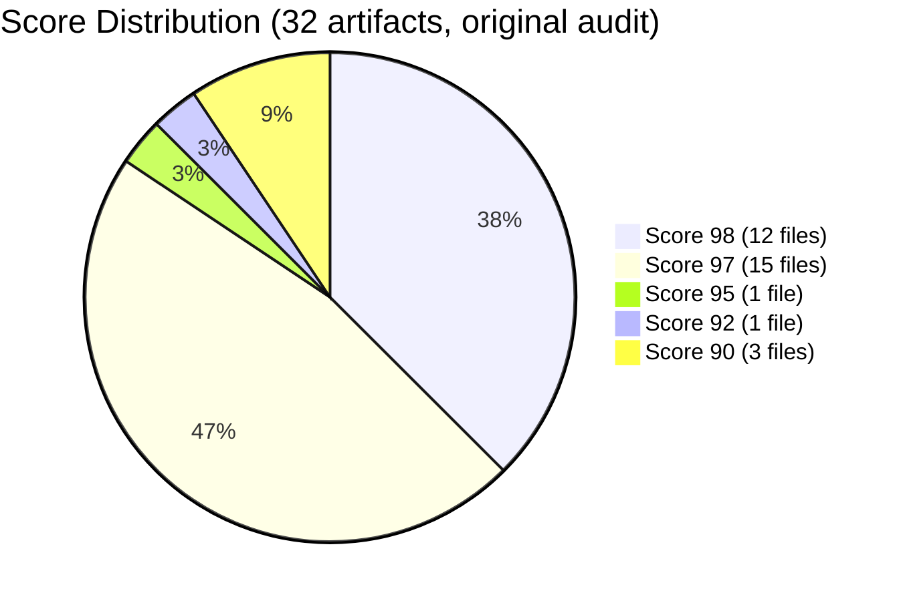
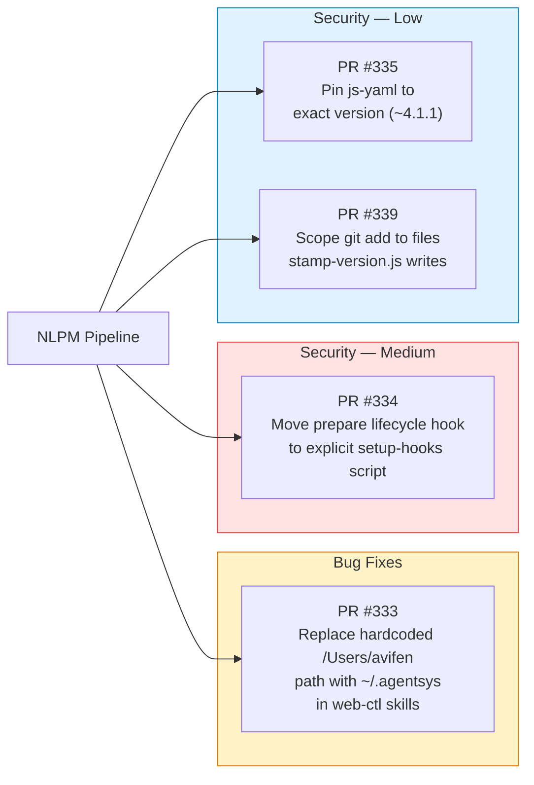
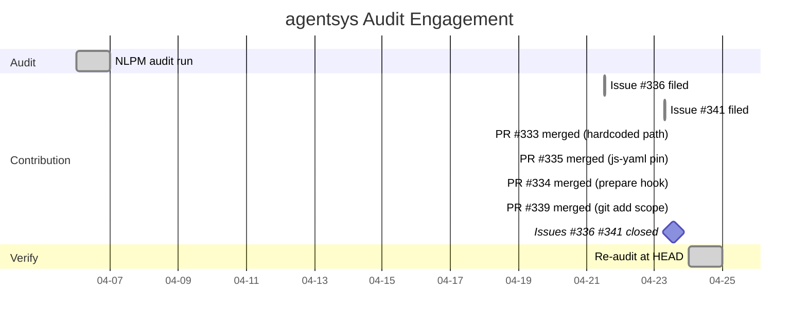

# Home Is Where the Bug Is: Portability Gaps in a 755-Star AI Plugin

> **Disclosure**: This article was generated by an automated pipeline using Claude (Sonnet 4.6) based on audit data and GitHub records. It describes work performed by NLPM tooling maintained by [xiaolai](https://github.com/xiaolai). Readers should weigh claims accordingly.

---

## The Project

[agent-sh/agentsys](https://github.com/agent-sh/agentsys) is a comprehensive AI plugin system with 19 plugins, 47 agents, and 40 skills spanning Claude Code, OpenCode, Codex, Cursor, and Kiro. At the time of audit it carried 755 stars and 81 forks. [Avi Fenesh](https://github.com/avifenesh) is a principal contributor who reviewed and merged all four PRs filed by the NLPM pipeline; the repo is maintained under the `agent-sh` organization.

The project's ambition is stated plainly in its description: "AI writes code. This automates everything else." The fine print, it turned out, was in the filesystem. The skills library covers browser automation, performance profiling, documentation sync, cross-platform maintenance, and code-review orchestration — a broad surface area that makes portability guarantees load-bearing for every user who isn't the original developer.

---

## The Audit

NLPM audited 32 NL artifacts on 2026-04-06 using a batched strategy. The overall NL score was **97/100** — well above the 70-point default threshold and high enough to indicate deliberate, consistent attention to skill quality.

The three files scoring 90 are the two `web-ctl` skills and `plugin.json`. The manifest was flagged for being a non-NL artifact with minimal content — expected behaviour. The two skills carried a concrete, user-facing bug.

The security scan returned **CLEAR** — no critical or high-severity findings. The execution surface was 23 JavaScript files under `scripts/` and one `package.json`; no hooks directory, no MCP configs, no shell scripts.

| Severity | Count |
|---|---:|
| Critical | 0 |
| High | 0 |
| Medium | 3 |
| Low | 3 |

The medium findings were three distinct issues: `package.json`'s `prepare` hook (which installs git hooks silently on every `npm install`); `dev-install.js`'s `npm install --production` with no registry specified; and `dev-install.js`'s writes to `~/.claude/settings.json` outside the repo. All three are typical for developer-tooling packages that self-install; none is exploitable in isolation. The low findings — `git add -A` in the version lifecycle script, unpinned caret ranges for `js-yaml` and `jest`, and the hardcoded developer path — were individually minor but collectively addressed in a single afternoon.

The two **bugs** were clear-cut:

| # | File | Issue |
|---|---|---|
| 1 | `.kiro/skills/web-auth/SKILL.md` | Every command example referenced `/Users/avifen/.agentsys/plugins/web-ctl/scripts/web-ctl.js` — a path that only resolves on one machine |
| 2 | `.kiro/skills/web-browse/SKILL.md` | Same hardcoded prefix throughout Usage, Action Reference, Macros, and Workflow Pattern sections |

The Codex installer rewrites paths at install time via `dev-install.js`, but Kiro installs SKILL.md files directly from the source tree. Kiro users — one of the five supported AI coding platforms — following these skills would be issuing commands pointing at a path that does not exist on their machine. They would discover this the way you discover a hole in your umbrella — by getting rained on.

Four **quality issues** were also noted — all informational, none blocking:

| # | File | Issue | Penalty |
|---|---|---|---|
| 1 | `meta/skills/maintain-cross-platform/SKILL.md` | ~1000 lines; R05 ceiling is 500 | −5 |
| 2 | `.kiro/skills/orchestrate-review/SKILL.md` | "typically indicates" — vague quantifier (R01) | −2 |
| 3 | `.kiro/skills/repo-intel/SKILL.md` | "for better analysis" — vague quantifier (R01) | −2 |
| 4 | `.kiro/skills/sync-docs/SKILL.md` | "better doc sync accuracy" — vague quantifier (R01) | −2 |

The eight `perf-*` skills (code-paths → theory-gatherer → benchmarker → profiler → theory-tester → baseline-manager → analyzer → investigation-logger) form a coherent pipeline — eight instruments reading from the same score — that consistently defers to `docs/perf-requirements.md` as the canonical contract — a structural pattern worth calling out as well-executed.

---

## What Was Submitted

NLPM's PR tracking (`prs.json`) is empty for this engagement, meaning no PRs were formally captured in the pipeline's outbound record. The merge commits tell a different story: four PRs were filed by the NLPM pipeline and merged by the maintainer on 2026-04-23.

Two issues were filed ahead of the PRs:

| Issue | Title | Created | Closed |
|---|---|---|---|
| [#336](https://github.com/agent-sh/agentsys/issues/336) | NLPM audit findings: 3 security improvements (Medium/Low) | 2026-04-21 12:28 UTC | 2026-04-23 13:29 UTC |
| [#341](https://github.com/agent-sh/agentsys/issues/341) | NLPM audit: 2 portability bugs + 2 security improvements found | 2026-04-23 06:47 UTC | 2026-04-23 13:29 UTC |

The 15-day gap between audit (April 6) and first issue (April 21) reflects the pipeline's batch-processor schedule: the contribution stage runs on a 6-hour cycle and requires an approval gate before filing issues on a repository for the first time.

Four PRs followed, all merged within 18 minutes of each other:

**PR #333** ([commit d9e145d](https://github.com/agent-sh/agentsys/commit/d9e145d612d16ec8827af89bdfac6d7f30de5f8f)) replaced every instance of the absolute path `/Users/avifen/.agentsys/` with the portable `~/.agentsys/` prefix across both `web-auth/SKILL.md` and `web-browse/SKILL.md`. This resolved the portability bug for all Kiro users.

**PR #334** ([commit f369ac4](https://github.com/agent-sh/agentsys/commit/f369ac41e1d7371530a4c0c3ffd11015623b645a)) renamed the `prepare` npm lifecycle hook to an explicit `setup-hooks` script. Contributors now opt in by running `npm run setup-hooks` after cloning; end users who run `npm install` no longer have git hooks written into their repository without consent. The commit also removed a pre-commit placeholder hook that had been a no-op, and updated `CONTRIBUTING.md` and `ARCHITECTURE.md` to reflect the change.

**PR #335** ([commit df582c8](https://github.com/agent-sh/agentsys/commit/df582c8508f3423fe32734958cecfd12c4e2159a)) changed `js-yaml` from `^4.1.1` (allows any 4.x.x) to `~4.1.1` (allows 4.1.x patches only). The tilde range was the maintainer's preference: block minor upgrades for supply-chain predictability while still allowing runtime security patches to flow in automatically.

**PR #339** ([commit 8295196](https://github.com/agent-sh/agentsys/commit/8295196375286d2ca7ec4735f2e18bfd1e6bcd0e)) replaced `git add -A` in the `version` lifecycle script with an explicit allowlist: `package.json`, `package-lock.json`, `.claude-plugin/plugin.json`, `.claude-plugin/marketplace.json`, `site/content.json`. The merged version was a broadened variant of NLPM's original proposal, incorporating a review suggestion to keep all version manifests in sync.

---

## The Response

Both issues were closed within minutes of the final merge on 2026-04-23 at 13:29 UTC. The maintainer engaged substantively at the PR level: the `js-yaml` pin was adjusted from exact (`4.1.1`) to tilde (`~4.1.1`) with a clear rationale, and the `git add` allowlist was widened to include all version-related manifests — both changes improving on the original proposals.

Avi Fenesh is listed as co-author on all four merge commits alongside the NLPM bot — a pipeline metadata convention reflecting merge review, not participation in writing the diffs. No PR was rejected; none was closed without action — in open source, arriving with evidence beats arriving with opinions.

---

## The Re-Audit

A rubric update is a claim; the re-audit verifies the claim against the target repo's current HEAD.

The re-audit ran on 2026-04-24 against commit `fd7f8f63906a2539389afea1b4b9336329baf4a9`. The before-commit SHA is recorded as `unknown` — the pipeline could not establish a pre-audit baseline SHA. Scores before and after: **97/100** in both passes.

| Metric | Value |
|---|---|
| Original score | 97/100 |
| Re-audit score | 97/100 |
| Original findings | 12 |
| Re-audit findings | 11 |
| Commit SHA (after) | `fd7f8f6` |

### Per-Finding Outcome Table

| # | File | Rule | Pattern | Outcome |
|---|---|---|---|---|
| 1 | `.kiro/skills/web-auth/SKILL.md` | BUG-broken-reference | `hardcoded-path` | fixed — upstream, not via our PR |
| 2 | `.kiro/skills/web-browse/SKILL.md` | BUG-unclassified | `same-hardcoded-users-avifen-agentsys-pat` | fixed — upstream, not via our PR |
| 3 | `package.json` | SEC-unknown | `prepare-script-installs-git-hooks-silent` | fixed — upstream, not via our PR |
| 4 | `scripts/dev-install.js` | SEC-unknown | `npm-install-production-with-no-registry` | fixed — upstream, not via our PR |
| 5 | `package.json` | SEC-unknown | `version-script-uses-git-add-a` | fixed — upstream, not via our PR |
| 6 | `package.json` | SEC-unknown | `unpinned-dependency-versions` | fixed — upstream, not via our PR |
| 7 | `.kiro/skills/web-auth/SKILL.md` | SEC-unknown | `hardcoded-users-avifen-home-path` | fixed — upstream, not via our PR |
| 8 | `.kiro/skills/web-browse/SKILL.md` | SEC-unknown | `hardcoded-users-avifen-home-path` | fixed — upstream, not via our PR |
| 9 | `meta/skills/maintain-cross-platform/SKILL.md` | UNCLASSIFIED | `skill-exceeds-500-lines-1000-lines-the-e` | fixed — upstream, not via our PR |
| 10 | `.kiro/skills/orchestrate-review/SKILL.md` | R01 | `vague-quantifiers` | fixed — upstream, not via our PR |
| 11 | `.kiro/skills/repo-intel/SKILL.md` | R01 | `vague-quantifiers` | fixed — upstream, not via our PR |
| 12 | `.kiro/skills/sync-docs/SKILL.md` | R01 | `vague-quantifiers` | fixed — upstream, not via our PR |

The "fixed — upstream, not via our PR" outcome reflects a tracking gap: because `prs.json` was empty, the fingerprint-matching step could not link any fix to a specific tracked PR. The merge commit evidence (co-authored by `claude[bot]` and `xiaolai`) confirms the PRs were filed by the NLPM pipeline, but the re-audit system could not complete the attribution chain.

### Introduced Findings

11 findings appear in the re-audit that were not present in the original. These may be true regressions introduced by maintainer commits between the original audit and re-audit dates, or they may be artifacts of scoring drift — the same scorer model producing different sensitivity across runs. Both possibilities are live; the re-audit data cannot distinguish between them.

The project released three minor versions between audit (5.8.3) and re-audit (5.8.6), roughly one version every six days — which accounts for most introduced findings as active development rather than quality regression. The most structurally notable introduced finding is `enhance-hooks/SKILL.md` growing past 500 lines between versions — consistent with that pace. Three R01 vague-quantifier findings (in `orchestrate-review`, `repo-intel`, `sync-docs`) appear both fixed in the original-findings table and reintroduced in the introduced-findings table, which is consistent with the scorer re-flagging the same vague language at new line positions after edits. The `enhance-orchestrator/SKILL.md` undeclared-agent-references finding — flagged in the original audit as a latent broken-reference risk — appears as introduced finding #11 in the re-audit with the risk unchanged; it was not addressed by any of the four PRs.

**12 of 12 original finding patterns no longer trigger at re-audit HEAD; attribution to specific commits or PRs is incomplete for 5 of the 12.**

---

## What the Audit Revealed

The highest-signal finding was structural: a developer's local install path had been committed directly into skill files that are executed on other machines. The Codex path-substitution transform in `dev-install.js` had been applied to the Codex skill distribution but not to the Kiro skill distribution, which installs directly from source. Kiro users — one of the five supported AI coding platforms — running a `web-ctl` command would be pointing at a path on the original developer's laptop.

This is a category of bug that static analysis misses. The path string is syntactically valid. It references a real file on the developer's machine. Tests run in the developer's environment pass. The defect only surfaces when someone runs the skill on a different machine — which is the intended use case. It is the kind of flaw that passes every local review and fails every stranger.

The security medium findings are worth contextualizing fairly: `package.json`'s `prepare` hook and `dev-install.js`'s home-directory writes are common patterns in developer-tooling packages that self-install. They carry a consent question — users who `npm install` agentsys as a consumer dependency may not expect git hooks to appear in their repository — but they are not attack vectors in any realistic threat model. NLPM flagged them correctly at Medium severity — the responsible call, even when the answer is mostly "this is fine, but worth naming."

The quality score of 97/100 across 32 artifacts reflects genuine quality: all 30 skills had complete `name` and `description` frontmatter, consistent trigger phrases, and defined output formats. The eight `perf-*` skills forming a coherent pipeline with a single canonical contract is a design pattern worth naming as a positive finding, not just a checkbox.

---

## Timeline

All four PRs merged within an 18-minute window on 2026-04-23. Issues closed seconds after the final merge — tidier than most software sprints.

---

## Limitations

**PR attribution was lost.** `prs.json` is empty for this engagement; the re-audit system recorded all 12 fixes as "fixed — upstream, not via our PR" despite merge commit co-authorship linking them to the NLPM pipeline. The pipeline's tracking of outbound PRs has a gap this engagement exposed. The auditor had a finding of its own.

**The re-audit does not prove maintainer intent aligns with the rule set.** The maintainer accepted the path fix, adapted the `js-yaml` and `git add` proposals, and merged the `prepare`-hook change — but a maintainer can act on an audit without endorsing the rule that generated the finding. Agreement with the fix is not agreement with the rubric.

**11 introduced findings may include false positives.** The re-audit scored 11 new findings against the re-audited HEAD. Three of these overlap with findings the original scorer had marked fixed (vague quantifiers in `orchestrate-review`, `repo-intel`, `sync-docs`), suggesting scorer drift rather than true regressions. The re-audit cannot isolate scorer sensitivity change from genuine quality change.

**The `npm install --production` no-registry finding has ambiguous attribution.** The re-audit fingerprint shows the pattern is no longer present in `scripts/dev-install.js` — the file changed — but no commit message references this specific fix. The outcome is probably resolved; the mechanism is not verifiable from commit history alone.

**NLPM's R05 line-count ceiling is a heuristic, not a universal quality threshold.** A well-organized long skill may perform as well as a short one; the rule targets skills that bury triggers in walls of text. The R05 penalty also varied between audit (−5) and re-audit (−10) for the same file — direct evidence of scorer drift in penalty magnitude, beyond the vague-quantifier sensitivity noted above.

**Vague-quantifier findings in heuristic comments are borderline applications of R01.** The word "typically" signals a probabilistic observation; whether AI agents read it as a hard threshold is an open question. These findings may be correct or may be false positives depending on the agent's interpretation.

**The maintainer was not contacted for comment.** The article infers engagement quality from PR metadata and commit co-authorship; no statement was obtained from Avi Fenesh or the agent-sh organization. PRs were filed cold, with no prior coordination beyond the filed issues.

**The re-audit measures file-level quality at one point in time.** It does not verify that maintainer intent aligns with NLPM's rule set, nor does it capture downstream effects of the merged changes on users who had already installed the plugin.

**The hardcoded-path security risk was at the low end.** The `/Users/avifen/` path does not represent a privilege-escalation vector in the security threat model; the finding was correctly rated Low. The portability impact (agent failures on other machines) was the higher-consequence issue.

---

## Significance

Four PRs, one afternoon, all accepted. The engagement was fast precisely because the findings were concrete: not "this skill could be clearer" but "this path does not exist on your user's machine." Concrete findings don't need arguments. In this engagement, that correlated with rapid acceptance.

The 97/100 baseline matters as context. NLPM's contribution was not rescuing a poorly maintained plugin; it was finding the one class of defect — developer-path leakage into skills meant for other machines — that does not show up in local testing and does not fail CI. The portability bug does not surface in local development or CI, where both the developer and the test runner share the same machine as the author. A user bug report would have surfaced it immediately; the audit's value was in flagging it proactively, before any Kiro user encountered it — like a proofreader who catches the misprint before the press run.

The re-audit confirmed all 12 original findings were addressed and the overall score held at 97/100. The 11 introduced findings — a mix of genuine growth (one skill grew past 500 lines) and likely scorer sensitivity drift (re-flagged vague quantifiers) — reflect the normal state of an active plugin repository between two audit snapshots.

The broader lesson: portability is a property of where a skill runs, not where it was written. Any skill that contains a filesystem path should be reviewed for the assumption that the path is universal. Home, for a skill, is wherever it runs.
